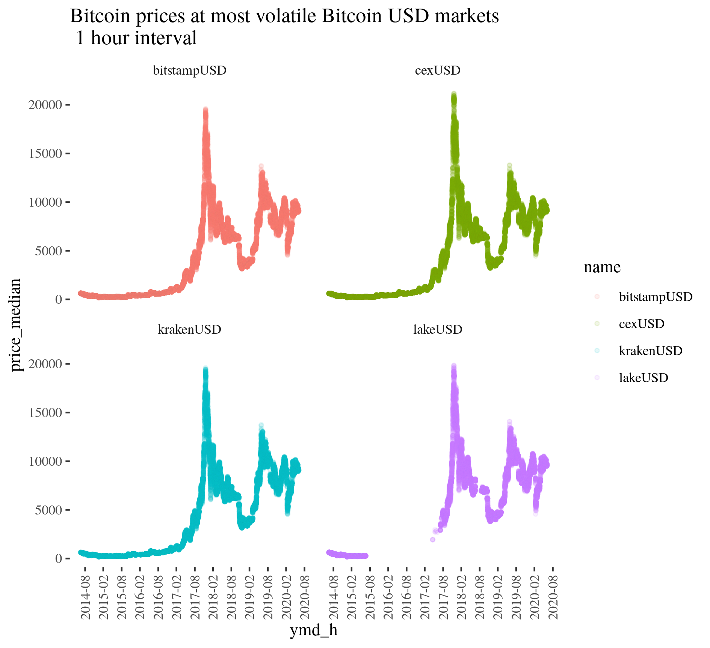

# bitcoinchartsr

Using high frequency bitcoin quotes from the bitcoincharts website.  
This project provide a bunch of functions which enabled to download and preprocess this data.  
Moreover there was built an example concerning usage of mentioned data.  
More precisely an investigation of a price mean spillover across Bitcoin markets was performed - a test for the market efficiency. 

bitcoincharts data usage - **upto a few hundred millions rows for all currencies and around 100 millions for USD markets**:

`R_funs.R` - Tutorial of downloading and preprocessing this data   
`bitcoin_spillovers.Rmd` - Exploration of Bitcoin markets efficiency

